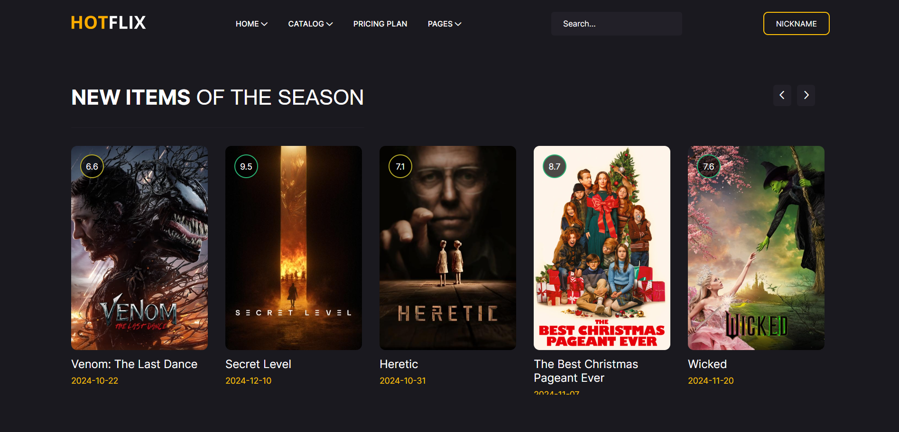
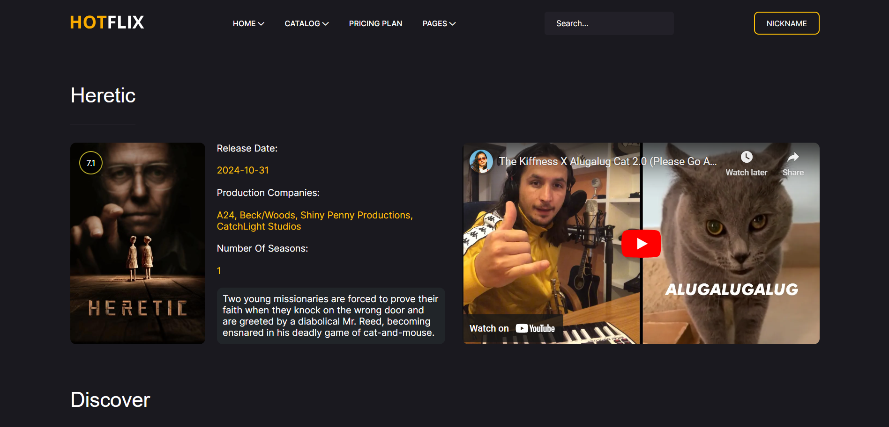

# Hotflix - Streaming Platform

Hotflix is a full-stack web application for movie enthusiasts to explore trending movies, genres, and their details. Users can enjoy a smooth movie exploration experience with dynamic data fetched using **The Movie Database (TMDb) API**.

## Table of Contents

- Features
- Technologies Used
- Project Structure
- Installation
- Deployment
- Screenshots

---

## Features

- **Responsive Design:** Fully responsive and adaptable layout for different devices.
- **Explore Movies:** View trending movies and discover detailed information.
- **Data Integration:** Powered by **The Movie Database (TMDb) API** for real-time movie updates..

## Technologies Used

- **HTML5**: Structure and content of the application.
- **CSS3**: Styling and layout design.
- **JavaScript**: Interactive functionality.
- **Font Awesome**: Icons used for UI elements.
- **External API:** The Movie Database (TMDb) API.

---

## Project Structure

```plaintext
Hotflix/
├── css/
│   ├── all.min.css
│   ├── style.css
├── images/
│   ├── logo.svg
├── scripts/
│   ├── header.js
│   ├── main.js
│   ├── movie.js
├── webfonts/
├── index.html
├── movie.html
```

---

## Installation

1. Clone the repository:

   ```bash
   git clone https://github.com/mostafadelgouda/Hotflix.git
   ```

2. Navigate to the project directory:

   ```bash
   cd Hotflix
   ```

3. Open the `index.html` file in your browser to view the project.

## Deployment

The project is live and can be accessed at [Hotflix Deployment Link](https://mostafadelgouda.github.io/Hotflix/)

## Screenshots

### Home Page



### Movie Page


